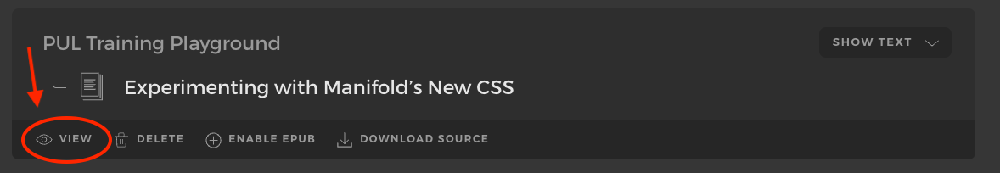
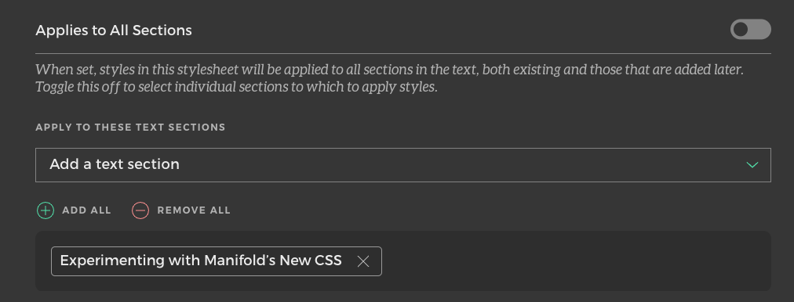

# Making changes to CSS for Open Publishing

To make changes to the CSS of texts in Open Publishing (hereafter referred to as Manifold in this document), styles should first be tested in the Manifold UI via changes made in Admin Mode.

You will need either a direct link to the text that you want to change, or you will need to know the name of the text and the parent project in Manifold of that text in order to proceed.

## Enter Admin Mode and Select the Text

1. Navigate to [https://openpublishing.princeton.edu/][https://openpublishing.princeton.edu/] and log in with CAS. Note that you will need to close the "Log In" view by clicking on the "X" at the top right corner of the interface once you log in.
1. Click on the "Enter Admin Mode" button in the top right corner of the screen.  If you do not see this button, contact our Open Publishing Product Owner for assistance.
1. Navigate to the text that you want to change.  You can do this by clicking on the "Projects" button in the top navigation menu and selecting "All Projects" from the dropdown.
1. Select the parent project of the text you want to change.
1. From within the project's dashboard, click on the "Texts" link in the left sidebar navigation.
1. Select the text that you want to change from the list of texts.

## CSS Development 

1. To preview the current way that the text is displaying, click on the "View" link directly under the text title, see screenshot below:

    
1. In Admin mode, click the "Styles" link in the left sidebar navigation, then click "Add New Stylesheet."
1. Name the stylesheet by populating the "Name" field.
1. Add the CSS that you want to apply to this text in the "Source Styles" field. 
1. Select the section(s) of the text to which you want to apply the CSS in the "Apply to these Text Sections" field, see example screenshot below:

    
1. Click "Save stylesheet."
1.  View the text from the "View" link under the text's title to see your CSS applied.

## Applying new CSS to the Site

CSS can be added per text individually within projects, or can be applied globally so that all new texts uploaded have a set of global styles applied to them.  Once new CSS is reviewed and confirmed with our Product Owner as being needed for all new texts in Manifold, the new CSS should be added to the global ingestion styles as follows.

**NOTE**: The global stylesheet is applied to each text when it is uploaded to Manifold.  Changes to the global ingestion styles from the "Integrations" section will be reflected for all new texts uploaded against that version of the global ingestion styles but will not be applied retroactively to texts that were uploaded against previous versions of the global ingestion styles.  Older texts should have any new changes needed applied to them individually within the "Styles" interface in the text's dashboard.

1. In Admin Mode, click on the "Settings" button in the top navigation menu and then click on the "Integrations" button from the submenu below that.
1. Add the new CSS to the bottom of the "Global Ingestion Styles" text area, then click "Save Settings."
1. Add the new CSS to the bottom of the custom stylesheet in this repository, located at `css/custom.css`.  This is where CSS changes are versioned.